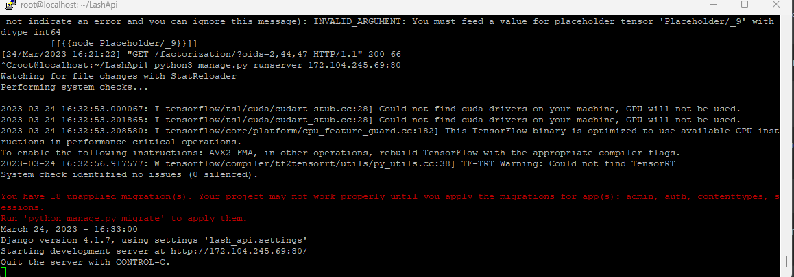

# LashApi
LashApi project 

## Installation
 Here is the installation process for building the Lash api project. Firstly make
 sure git is installed

```bash
sudo apt-get install git
```
After that perform git clone:
```bash
git clone https://github.com/PanagiotisDrakatos/LashApi
cd LashApi
```
To continue make sure the [setup.sh](https://github.com/PanagiotisDrakatos/LashApi/blob/master/setup.sh) script has the required permissions 
to run correctly

```bash
chmod 777 setup.sh
sudo ./setup.sh
```

After the successful setup of the environment we need to make sure that the server 
is started. As a result we execute the following command:
```bash
python3 manage.py runserver 'IP':80 
```
We wait to see the following screenshot. 
This command will ensure our server is bootsraped with the given ip in the port 80


## Test Api
 Open a browser and hit the following and wait patiently your result
 
```bash
http://172.104.245.69/factorization/?oids=2,44,47

{"deck": 3, "flid": 2, "x": 57.694985824714, "y": 11.911623515189}
```

**Attention!!!** One last thing in the first run we make sure we wait at least 3 min for the api to execute.